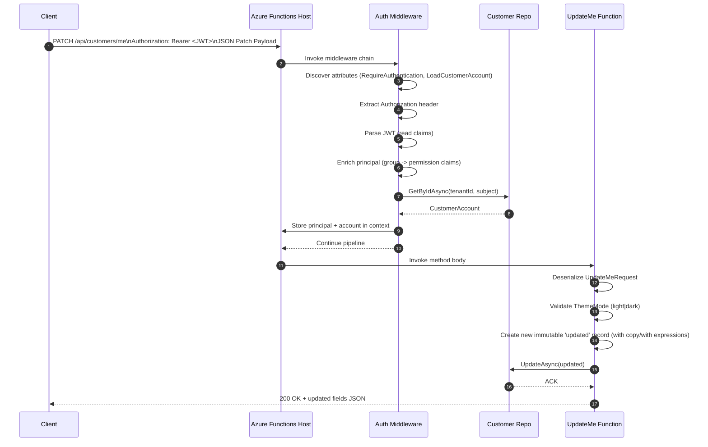

# Authorization & Claims Flow

This document illustrates how an HTTP request that requires authentication/permissions flows through the Azure Functions isolated worker in this service. Two diagrams:

1. Generic flow for any protected endpoint using the attribute + middleware model.
2. Concrete example: `PATCH /api/customers/me` (UpdateMe) endpoint.

## 1. Generic Protected Request Flow

Legend:
- Attr: attributes decorating the Function method (`[RequireAuthentication]`, `[RequirePermissions]`, `[AuthorizePolicy]`, `[LoadCustomerAccount]`)
- MW: Authorization middleware (`AuthorizationMiddleware`)
- Repo: Data repositories (`ICustomerRepository`, etc.)

```mermaid
flowchart TD
    A[Client Request]\nHTTP + Authorization: Bearer token --> B[Azure Functions Host]
    B --> C[Function Discovery]\nResolve method & attributes
    C --> D{Any Auth Attributes?}
    D -- No --> H[Invoke Function Body]
    D -- Yes --> E[AuthZ Middleware]
    E --> E1{Authorization Header?}
    E1 -- Missing --> Z1[401 Problem JSON]\nstop
    E1 -- Present --> E2[Parse JWT (no sig check in demo)]
    E2 --> E3[Build ClaimsPrincipal]
    E3 --> E4[Enrich Claims via IClaimsMappingService]\n(map AAD group claims -> permission claims]
    E4 --> E5[Store Principal & Jwt in FunctionContext.Items]
    E5 --> E6{[RequirePermissions]?}
    E6 -- Yes --> E6a[Verify ALL required permissions]
    E6a -- Missing --> Z2[403 Problem JSON]\nstop
    E6 -- No --> E7{[RequireAnyPermissions]?}
    E7 -- Yes --> E7a[Verify ANY one permission]
    E7a -- None --> Z2
    E7 -- No --> E8{[AuthorizePolicy]?}
    E8 -- Yes --> E8a[Evaluate policy delegate]
    E8a -- Fail --> Z2
    E8 -- No --> E9{[LoadCustomerAccount]?}
    E9 -- No --> H
    E9 -- Yes --> E9a[Resolve subject + tenant]
    E9a --> E9b[Repo.GetByIdAsync]
    E9b --> E9c{Account found?}
    E9c -- No --> Z3[404 Problem JSON]\nstop
    E9c -- Yes --> E9d[Store CustomerAccount in Context.Items]
    E9d --> H
    H --> I[Function Body Executes]\n(Business Logic Only)
    I --> J[Create Response]
    J --> K[Return HTTP Response]
```

### Notes
- Signature validation is intentionally simplified; production flow should validate token (APIM `<validate-jwt>` or middleware with key material / OIDC metadata).
- New policies are added by registering evaluators in `PermissionPolicyRegistry`.
- Adding a new permission only needs: constant + optional group mapping in configuration.

## 2. UpdateMe Endpoint Flow (`PATCH /api/customers/me`)

Attributes applied:
```csharp
[RequireAuthentication]
[LoadCustomerAccount]
public async Task<HttpResponseData> UpdateMe(...)
```

Specific path highlighting payload validation & partial update logic.



### Field Update Rules
- Only provided (non-null) optional fields overwrite existing data.
- `ThemeMode` update uses nested record copy: `account.Preferences with { ThemeMode = payload.ThemeMode }`.
- Audit metadata updated centrally: `UpdatedUtc = UtcNow`, `UpdatedBy = account.Id`.

### Failure Paths (Abbreviated)
| Condition | Response |
|-----------|----------|
| Missing Authorization header | 401 { error: "Missing token" } |
| Invalid JWT parse | 401 { error: "Invalid token" } |
| Customer not found | 404 { error: "Account not found" } |
| Invalid ThemeMode | 400 { error: "themeMode must be 'light' or 'dark'" } |

## 3. Extension & Maintenance Considerations

| Scenario | Change Required |
|----------|-----------------|
| Add new role/permission | Add constant + group mapping; decorate new function with `[RequirePermissions]` or add to policy. |
| Add composite rule (e.g. AdminRead OR FeatureFlagX) | Register new policy in `PermissionPolicyRegistry` and use `[AuthorizePolicy]`. |
| Apply to new Function | Add attributes; no boilerplate auth code needed inside method. |
| Return standardized error shape | Already centralized in middleware `ShortCircuit` helper. |
| Strengthen token validation | Implement signature/issuer/audience validation (APIM or new validation step before enrichment). |

## 4. Potential Future Enhancements
- Token validation via OpenId configuration + caching signing keys.
- Caching loaded customer record (ETag) to reduce repository calls on high-frequency endpoints.
- Attaching correlation / request IDs in middleware to improve tracing.
- Emitting structured security audit events (success + failures) to Application Insights or Event Hub.

---
Generated: Auth flow documentation for current attribute-based authorization model.
