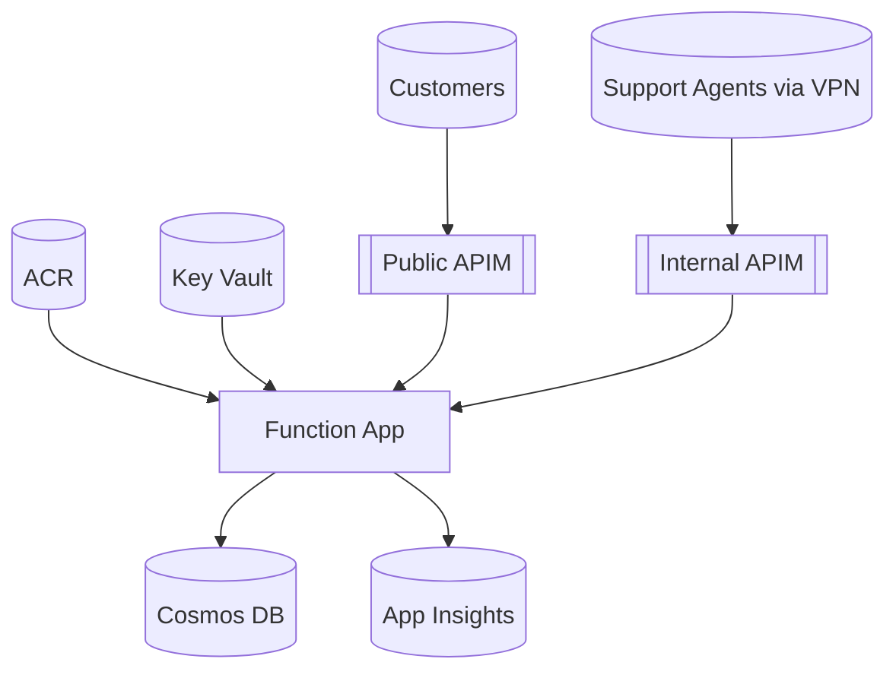

# Customer Service Platform - Iteration Diagrams

## 1. High-Level Architecture Diagram

```
                               +---------------------------+
                               |  Developer Workstation    |
                               |  (Build & Push Image)     |
                               +-------------+-------------+
                                             |
                                             v
+-------------------------+        +----------------------------+
| Azure Container         |  Pull  |   Azure Container Registry |
| Registry (ACR)          +<-------+   (custsvc<env>acr)        |
+------------+------------+        +--------------+-------------+
             |                                      ^
             | Image reference (linuxFxVersion)     |
             v                                      |
+------------+--------------------------------------------------+
|                 Azure Function App (Customer & Admin APIs)    |
|  Runtime: .NET Isolated (container)                           |
|  Endpoints:                                                  |
|    Public: /api/customers/*   (CustomerFunctions)            |
|    Admin:  /api/admin/*       (AdminFunctions)               |
|  Identity: System Assigned Managed Identity                  |
|  App Settings: JWT_*, COSMOS_*                               |
+------+----------------------+------------------+-------------+
       |                      |                  |
       |                      |                  |
       |   Read/Write         | Secrets          | Telemetry
       v                      v                  v
+--------------+    +------------------+    +--------------------+
|   Cosmos DB  |    |  Key Vault        |    | App Insights       |
|  (Serverless)|    | (jwt-signing-key) |    |  (Logs/Telemetry)  |
+--------------+    +------------------+    +--------------------+

            ^                        ^
            |                        | (future: signing via KV key)
            |                        |
      +-----+------------------------+----+
      |    API Management (Public)        |
      |  SKU: param customerApimSkuName   |
      |  API: customer-api (path /customer)|
      +-----+-----------------------------+
            ^
            | HTTPS (Internet)
            |
+-----------+-------------+         +---------------------------+
|  Web / Mobile Clients   |  ...    |  3rd Party Integrations   |
+-------------------------+         +---------------------------+


        (Internal Network / VNet)
                +-----------------------------------------------+
                |  Virtual Network (10.0.0.0/16)                |
                |   Subnet: apim-admin-snet (10.0.0.0/24)       |
                |                                               |
                |  +-----------------------------------------+  |
Inbound (VPN) -->|  | API Management (Internal)              |  |
                |  |  Name: *-apim-admin                    |  |
                |  |  API: admin-api (path /admin)          |  |
                |  +------------------+----------------------+  |
                +---------------------|------------------------+
                                      |
                                      | (Private network traffic)
                                      v
                       +--------------+--------------------------------+
                       |  Azure Function App (public endpoint used)    |
                       +------------------------------------------------

```

### Key Points
- Single Function App currently serves both public and admin endpoints (admin isolation achieved via internal APIM + VPN). 
- Future hardening: Add private endpoint for Function App and deploy a second Function App exclusively for admin; then internal APIM would call private IP only.
- ACR supplies container image; Key Vault stores JWT signing key (optionally future Key Vault key for asymmetric signing).

---

## 2. Network Flow Diagram

```
                      INTERNET ZONE
  +-------------------------------------------------------------+
  |                                                             |
  |  Public Clients / Browsers / Mobile Apps                    |
  |        |                                                     |
  +--------|-----------------------------------------------------+
           | HTTPS (Public DNS e.g. api.example.com)
           v
    +-----------------------------+   Public IP / DNS
    |  Public APIM (customer)     |   (customer traffic)
    |  - customer-api             |
    +--------------+--------------+
                   |
                   | Internal Azure Backbone (Public -> PaaS)
                   v
          +-----------------------------+
          |  Azure Function App         |
          |  /api/customers/*           |
          |  /api/admin/*  (reachable   | <-- (currently still public; to be privatized later)
          +-----------+-----------------+
                      |
          +-----------+------------+-------------+
          |                        |             |
          v                        v             v
    +-----------+           +------------+  +-----------+
    | Cosmos DB |           | Key Vault  |  | App       |
    |           |           |  Secret    |  | Insights  |
    +-----------+           +------------+  +-----------+


                SECURE CORPORATE NETWORK / VPN
  +-------------------------------------------------------------------+
  |  Customer Service Agents (Laptops)                                |
  |      |                                                            |
  |      | Encrypted Tunnel (VPN)                                     |
  |      v                                                            |
  |  +----------------------+        Azure VNet 10.0.0.0/16           |
  |  | Corporate VPN GW /   |-------------------------------------+   |
  |  | SASE Entry Point     |                                     |   |
  |  +----------------------+                                     |   |
  |                                                              |   |
  |     (10.0.0.0/24) Subnet apim-admin-snet                      |   |
  |        +-----------------------------------------------+      |   |
  |        | Internal APIM (admin)                         |      |   |
  |        |  - admin-api (/admin)                         |      |   |
  |        +----------------------+------------------------+      |   |
  |                               |                               |   |
  +-------------------------------|--------------------------------+---+
                                  | Private Network Call
                                  v
                       +----------+-----------+
                       | Azure Function App  |
                       | /api/admin/*        |
                       +----------+----------+
                                  |
                                  v
                              Back-end Data

```

### Network Segmentation Summary
- Public Zone: Internet clients reach only the public APIM endpoint; admin APIs are not exposed here.
- Secure Zone (VNet): Internal APIM reachable only via VPN. Agents must authenticate through corporate VPN first.
- Function App: Still public; trust boundary relies on internal APIM + app-layer authorization. Recommended enhancement: add Private Endpoint + split admin workload to a separate Function App; remove public exposure of admin endpoints.

### Future Hardening Recommendations
| Area | Recommended Action | Benefit |
|------|--------------------|---------|
| Function App Admin Surface | Add Private Endpoint + Access Restrictions | Eliminates public path to admin routes |
| Separation of Duties | Deploy second Function App for admin-only code | Reduced blast radius, simpler WAF rules |
| Secrets | Migrate symmetric signing key to KV Key (RSA) | Enables key rotation & HSM protection |
| Observability | Add Diagnostic Settings for APIM & Function to Log Analytics | Unified operational insights |
| Zero Trust | Enforce Conditional Access on VPN + AAD group->claim mapping (already app-level) | Stronger identity posture |

---

## Mermaid Versions (Optional)
You can render these if your tooling supports Mermaid.

```mermaid
flowchart LR
    subgraph Internet
      Client[Public Clients]
    end
    subgraph Corp[Corporate Network via VPN]
      Agent[Support Agent]
    end
    subgraph VNet[Azure VNet 10.0.0.0/16]
      AdminAPIM[[Admin APIM (Internal)]]
    end
    PublicAPIM[[Public APIM]]
    FuncApp[(Function App)]
    Cosmos[(Cosmos DB)]
    KV[(Key Vault)]
    AI[(App Insights)]

    Client -->|HTTPS /customer/*| PublicAPIM --> FuncApp
    Agent -->|VPN Tunnel| AdminAPIM -->|/admin/*| FuncApp
    FuncApp --> Cosmos
    FuncApp --> KV
    FuncApp --> AI
```



---

## Legend
- APIM (Public): Internet-facing API Management instance for customer operations.
- APIM (Internal): VNet-integrated API Management for admin operations; reachable only over VPN.
- Function App: Containerized .NET isolated runtime hosting both sets of functions (current iteration).
- Cosmos DB: Multi-tenant customer data store (serverless).
- Key Vault: Holds JWT signing secret (future: asymmetric key).
- ACR: Hosts container images for Function App.
- App Insights: Telemetry & logging.

## Open Items / Risks
1. Admin routes still technically callable directly (public) unless code-level or APIM header checks enforced – plan Private Endpoint next.
2. No network restriction on Cosmos DB (public network enabled). Consider enabling network ACL + private endpoint later.
3. Single Function App mixes trust levels; splitting reduces risk and allows independent scaling.

---
Generated on: 2025-09-02

---

## 3. Admin vs Non-Admin API Separation Diagram

### 3.1 Combined Architecture & Flow (Contrast View)

```
                          ┌──────────────────────────┐
                          │   Shared Function App    │
                          │  (Container .NET Isolated)│
                          │                          │
        ┌─────────────────┼───────────────┬──────────┘
        │                 │               │
        │                 │               │
        │         (Public HTTP)     (Private/VNet HTTP)
        │                 │               │
        v                 v               v
┌─────────────┐   ┌────────────────┐  ┌────────────────────┐
│  Public     │   │ Customer       │  │ Internal APIM      │
│  Clients    │──▶│   APIM         │  │ (Admin APIM)       │
│ (Internet)  │   │ (customer-api) │  │ (admin-api)        │
└─────────────┘   └──────┬─────────┘  └─────────┬──────────┘
                          │                     │
                          │                     │
                    /api/customers/*      /api/admin/*
                          │                     │
                          └──────────┬──────────┘
                                     v
                         ┌──────────────────────┐
                         │  CustomerFunctions   │
                         │  (Public surface)    │
                         └──────────────────────┘
                         ┌──────────────────────┐
                         │   AdminFunctions     │
                         │ (Privileged ops)     │
                         └──────────────────────┘
                                     │
                   ┌─────────────────┼──────────────────┐
                   v                 v                  v
            ┌────────────┐   ┌──────────────┐   ┌──────────────┐
            │  Cosmos DB │   │   Key Vault  │   │ App Insights │
            └────────────┘   └──────────────┘   └──────────────┘

Legend:
  Green Path (public): Public Clients -> Public APIM -> /api/customers/*
  Blue  Path (internal): Agents (VPN) -> Internal APIM -> /api/admin/*
  Both sets converge in same Function App codebase (current iteration)
```

### 3.2 Layered Responsibility Split

```
 Layer                Non-Admin (Customer)                 Admin (Operational)
 ------------------   ----------------------------------  --------------------------------------
 Entry / DNS          Public DNS (customer API domain)     Internal DNS / Private IP (VNet)
 Gateway/AuthZ        Public APIM (JWT / rate-limit)       Internal APIM (VPN + claims mapping)
 App Surface          CustomerFunctions endpoints          AdminFunctions endpoints
 AuthZ Model          Customer role claims ("customer")    Admin permission claims (rw/r)
 Data Access          Reads/Writes own customer record     Cross-tenant / any customer operations
 Network Boundary     Internet -> APIM -> Function App     VPN -> VNet -> Internal APIM -> Function
 Future Hardening     Split Function App (optional)        Private Endpoint mandatory
 Logging              Standard request metrics             Extended audit, change logs
```

### 3.3 Mermaid Separation View

```mermaid
flowchart TB
  subgraph PublicZone[Public Zone]
    C[Clients]
    PUB[[Public APIM\ncustomer-api]]
  end
  subgraph Secure[VNet (Internal)]
    VPN[VPN Gateway]
    IAPIM[[Internal APIM\nadmin-api]]
  end
  FA[(Function App)]
  subgraph Code[Function Code]
    CF[CustomerFunctions]
    AF[AdminFunctions]
  end
  COS[(Cosmos DB)]
  KV[(Key Vault)]
  AI[(App Insights)]

  C -->|/customer/*| PUB --> FA
  VPN --> IAPIM -->|/admin/*| FA
  FA --> CF
  FA --> AF
  FA --> COS
  FA --> KV
  FA --> AI
```

### 3.4 Evolution Path (Current -> Target)

Current: Single Function App (public). Internal APIM relies on app-layer auth to prevent misuse if direct public call to /api/admin/*.

Target (Recommended):
1. Introduce second Function App (admin) with private endpoint, remove admin routes from public app.
2. Internal APIM routes only to private admin Function App; network ACL denies public.
3. Add APIM mutual TLS or client cert for additional defense-in-depth.
4. Add dedicated audit log sink (e.g., Log Analytics table or Event Hub) for admin mutations.

### 3.5 Risk Matrix (Current Consolidated Deployment)

| Risk | Vector | Current Mitigation | Residual | Future Control |
|------|--------|--------------------|----------|----------------|
| Direct admin endpoint invocation | Public Internet | AuthZ claim check | Medium | Private Endpoint + split app |
| Lateral exposure via shared runtime | Function exploit | Least privilege roles | Medium | Separate runtime / container |
| Incomplete audit of admin changes | Missing logs | Basic App Insights traces | Medium | Structured audit events + immutability |
| Key leakage (symmetric JWT) | App config | KV secret + limited RBAC | Low | Asymmetric KV key + rotation policy |

---
