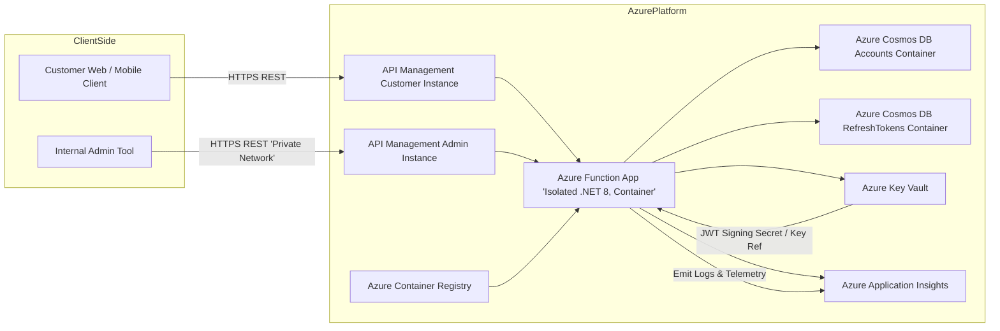
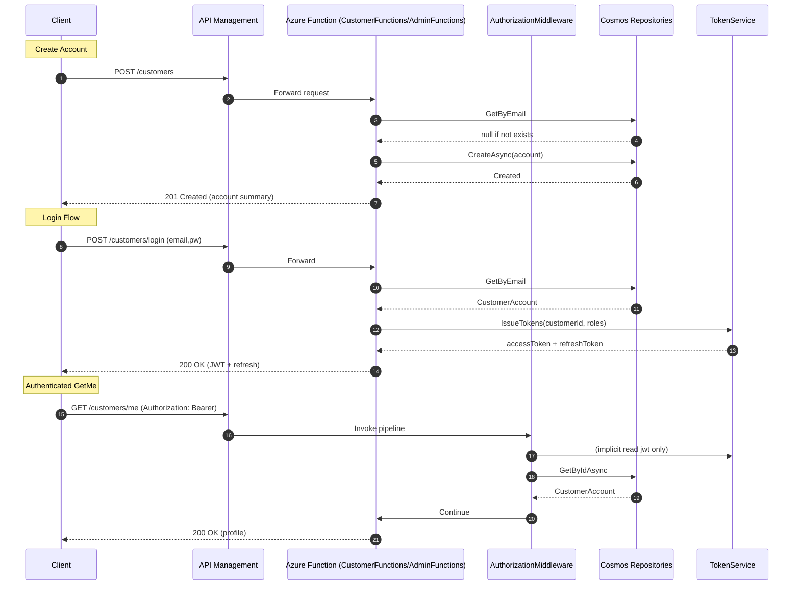
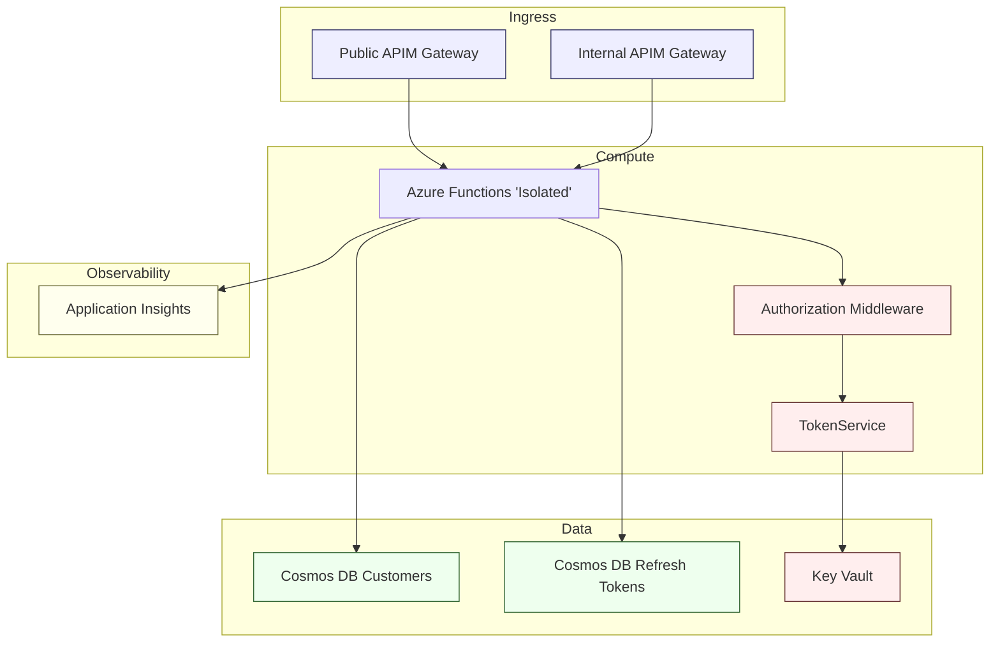

User Request:
can you analyse all the code in this workspace (including all IaC and configuration files) and do the following:
- tell me what the purpose of this software is
- draw an architural diagram of the tech stack
- draw a diagram of program flow
- draw a diagram showing parts of the stack that address key information security concerns

As you produce output into this chat, keep a word-for-word record of my inputs and your outputs in a file called repository-analysis-with-iac-pass-1.md in the root of the workspace.

Assistant Response (analysis pass 1):

## Purpose of the Software
This project implements a customer account management and profile API using Azure Functions (isolated .NET 8 worker) fronted by Azure API Management (separate public customer and internal admin gateways). It provides endpoints for customer self-service (create account, login, refresh placeholder, MFA enroll/verify, view/update own profile) and administrative endpoints (retrieve/update arbitrary customer accounts) with a custom attribute-based authorization and permission mapping model. Persistence uses Azure Cosmos DB for customer accounts and refresh tokens. JWT access and refresh tokens are issued by an in-process TokenService (optionally integrating with Azure Key Vault for signing keys) and enriched with role and permission claims for fine-grained authorization. Infrastructure as Code (Bicep) provisions supporting Azure resources including APIM instances (public & internal), Function App (container-based), Key Vault, Cosmos DB, and Container Registry.

## Architectural Diagram (Tech Stack)

## Program Flow Diagram (Selected Use Cases)

## Information Security Coverage Diagram

### Security Mapping
* Network segregation: Separate Admin APIM (internal / VNet). Public customer APIM for external clients.
* Authentication: JWT access tokens issued with issuer, audience, sub, jti, roles; custom middleware parses tokens.
* Authorization: Attribute-based; permission claims added through group mapping (AAD groups -> internal permission claims). Policies (AdminRead/AdminWrite) evaluate claims.
* Secrets & Keys: Key Vault provisioned for JWT signing secret (placeholder secret resource). Potential extension to asymmetric keys via Key Vault keys (TokenService scaffolding present).
* Data Protection: Cosmos DB accounts container uses unique key on tenantId + normalizedEmail for uniqueness; serverless option; publicNetworkAccess currently Enabled (could be restricted). Soft delete & purge protection enabled on Key Vault; Cosmos local auth disabled (requires AAD / RBAC).
* MFA: TOTP enrollment & verification endpoints (demo; not bound to accounts yet) show path for multi-factor security.
* Audit: Basic audit metadata fields (CreatedUtc, UpdatedUtc, UpdatedBy) maintained when updating records.
* Observability: Application Insights instrumentation added; Serilog console sink for container logs.
* Supply Chain: Container built from dotnet/aspnet:8.0-alpine and deployed from ACR; retention policy set to 7 days for images; quarantine disabled (could be enabled for stricter controls).
* Least Privilege Opportunities: Separate internal admin surface suggests potential for stricter network ACLs and Key Vault access policies via managed identity.

### Notable Gaps / Recommendations
1. Refresh Token Persistence: Currently in-memory dictionary; repository exists but not wired into TokenService or endpoints (Refresh token flow unimplemented). Implement secure hashed storage and binding to user & device, plus revocation logic.
2. JWT Validation: Middleware only parses token without signature validation or expiry checks; must integrate Microsoft.IdentityModel.Tokens TokenValidationParameters for full validation.
3. Key Vault Integration: TokenService scaffolds for asymmetric signing but throws NotImplementedException path; implement cryptographic signing or load RSA key material securely.
4. Secrets Exposure: JWT_SIGNING_KEY is passed directly via app settings (dev). Move to Key Vault secret retrieval at startup and avoid including raw secret in configuration for production.
5. MFA Binding: Enroll/verify endpoints not tied to user identity; storing and verifying encrypted TOTP secrets per user is necessary.
6. Cosmos Network ACL: publicNetworkAccess Enabled; consider restricting via private endpoints and disabling direct public access.
7. Security Headers / Rate Limiting: Add APIM policies for throttling, origin restrictions, and remove verbose error details.
8. Password Policy & Lockout: Model supports tracking failed attempts/lockout but logic not implemented; add enforcement in login path.
9. Logging PII: Avoid logging sensitive user data (currently logs email on account creation); ensure GDPR/PII scrub rules in production.
10. Admin Function Isolation: Consider separate Function App with private endpoint rather than shared publicly reachable backend.

End of assistant response.
