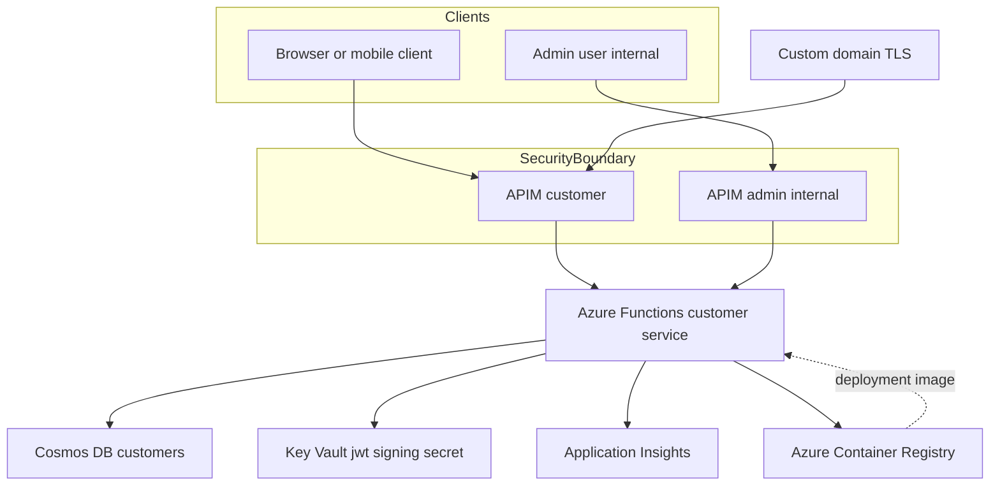
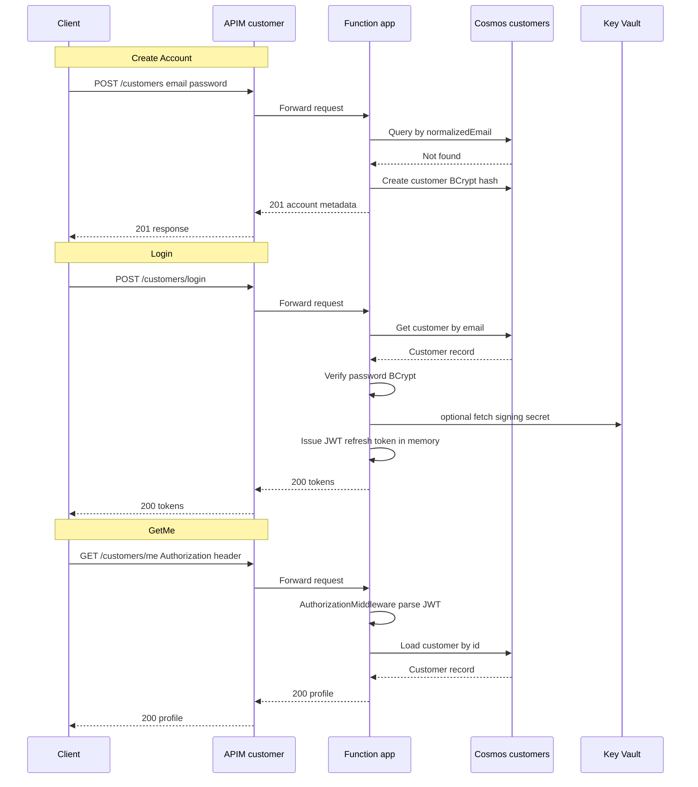
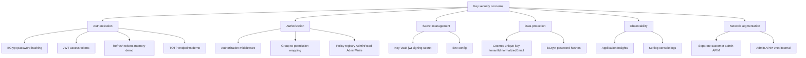

User:
can you analyse all the code in this workspace (including all IaC and configuration files) and do the following:
- tell me what the purpose of this software is
- draw an architural diagram of the tech stack
- draw a diagram of program flow
- draw a diagram showing parts of the stack that address key information security concerns

As you produce output into this chat, keep a word-for-word record of my inputs and your outputs in a file called repository-analysis-with-iac-pass-2.md in the root of the workspace.

Ignore existing .md files - don't read their content as part of your analysis. Where possible, use mermaid diagrams for ease of viewing. Ensure the syntax and characters used in the mermaid diagrams are highly compatible with most parsers. For example, don't use parentheses, ( or ), anywhere in the mermaid diagram syntax.

Assistant:
## Purpose
This project implements a customer account service delivered as a .NET 8 isolated Azure Functions app packaged in a Linux container and fronted by two Azure API Management APIM gateways public customer API and internal admin API. It provides customer account lifecycle create account login issuing JWT and refresh token profile retrieval and update basic MFA enrollment and verification stub demo authorization via custom middleware that maps external group claims to internal permission claims and storage of customer data and intended refresh tokens in Azure Cosmos DB. Infrastructure as Code Bicep provisions supporting Azure resources Function App container Cosmos DB with a customers container Key Vault JWT signing secret API Management instances Virtual Network for internal admin APIM and a Container Registry for the function image.

## High level summary
- Runtime Azure Functions isolated worker .NET 8 with Serilog and Application Insights.
- AuthN Local password BCrypt plus issued JWT access tokens and in memory refresh tokens persistent refresh token repo interface exists but not yet wired in logic and refresh token container not provisioned in Bicep.
- AuthZ Custom attributes plus middleware enforce permissions policies mapped from external group claims to internal permission claim type cs.permission.
- Data Customer accounts stored in Cosmos DB customers container partition key tenantId with unique key on tenantId plus normalizedEmail.
- Secrets Keys Option to use Key Vault key for asymmetric signing not fully implemented and Key Vault secret for symmetric fallback signing key jwt signing key. Current code always falls back to symmetric if KV signing not implemented.
- MFA TOTP enrollment and verification endpoints demo quality no persistence of secrets yet placeholder email no linkage to account state.
- Separation of concern Public customer endpoints vs internal admin endpoints exposed through separate APIM instances admin APIM intended to be internal via VNet integration.

## Architectural diagram

## Program flow diagram selected flows

## Security components diagram

## Security assessment highlights
- Password storage BCrypt with salt per hash library default. Consider versioning and rehash on login when work factor increases.
- JWT signing Symmetric key from configuration or Key Vault secret. Asymmetric path via Key Vault not implemented and falls back. Implement RSA signing and validation.
- Refresh tokens In memory dictionary only. Persist with Cosmos repository and bind to user id. Add rotation and reuse detection.
- JWT validation Middleware only parses token without validating signature audience issuer expiry. Critical gap must add full validation.
- MFA Demo only. Need to persist encrypted secret per user and enforce during login.
- Authorization Policy and permission system sound but depends on trusted group claims ensure upstream identity provider tokens validated first.
- Data validation Minimal add input length email format password complexity checks rate limiting anti enumeration responses.
- Secrets Key Vault used ensure managed identity has get secret permission and remove plaintext jwtSigningKey parameter in production.
- Network Cosmos and Key Vault public access enabled restrict with private endpoints and service endpoints for production.

## Gaps and improvement recommendations
1. Implement robust JWT validation in AuthorizationMiddleware using TokenValidationParameters.
2. Persist refresh tokens in Cosmos add refreshTokens container in IaC and update TokenService to store verify revoke.
3. Complete Key Vault asymmetric signing path or remove to reduce complexity.
4. Integrate MFA secret storage and challenge flow into login endpoint.
5. Strengthen input validation and add rate limiting and logging of suspicious patterns.
6. Harden networking private endpoints disable public network where feasible restrict APIM inbound.
7. Add structured logging and correlation plus alert rules and dashboards.
8. Add unit tests for middleware and token validation failure scenarios.
9. Consider separating admin functions into isolated function app behind internal ingress only.
10. Add automated secret rotation pipeline for JWT signing key.

## Notable IaC observations
- Only customers container defined refresh token container missing versus code interface presence.
- Key Vault secret created but no explicit access policies RBAC assumed. Assign Function App managed identity get list secrets.
- Function App container image reference expects repo path systemName/customer-service:latest push pipeline needed.
- Admin APIM internal uses VNet but backend Function remains public. Consider private endpoint or separate internal function app.

## Summary
Early stage customer identity profile service with core account CRUD auth scaffolding plus infrastructure baseline. Requires production hardening for token validation persistence MFA network and secret management to meet typical security standards.
