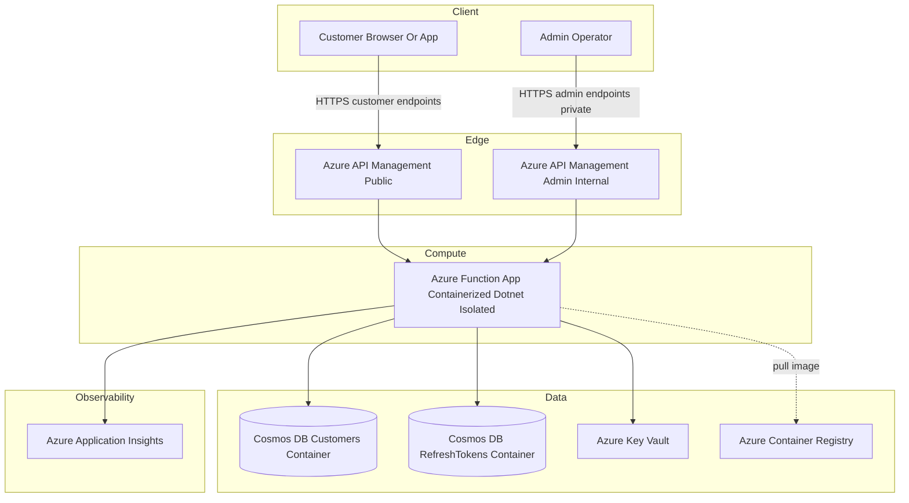
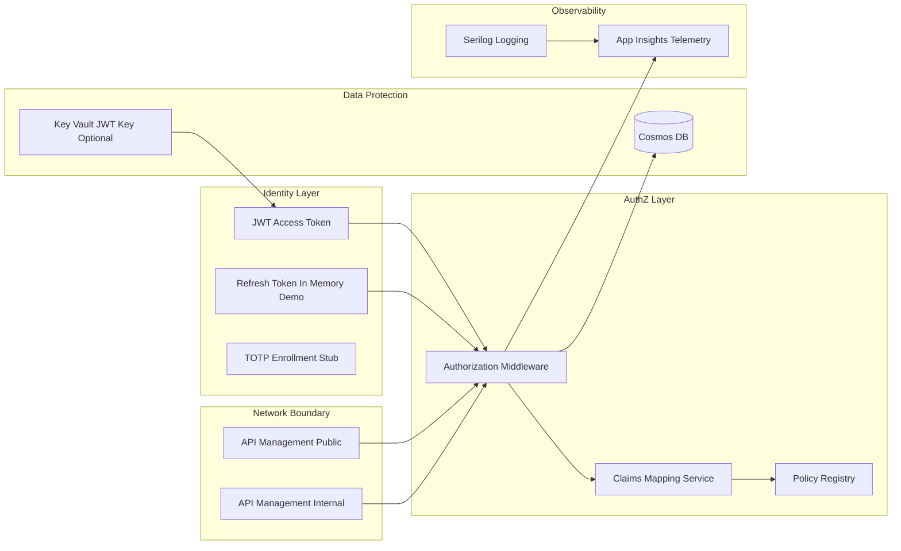

USER: can you analyse all the code in this workspace (including all IaC and configuration files) and do the following:
- tell me what the purpose of this software is
- draw an architural diagram of the tech stack
- draw a diagram of program flow
- draw a diagram showing parts of the stack that address key information security concerns

As you produce output into this chat, keep a word-for-word record of my inputs and your outputs in a file called repository-analysis-with-iac-pass-3.md in the root of the workspace.

Ignore existing .md files - don't read their content as part of your analysis. Where possible, use mermaid diagrams for ease of viewing. Ensure the syntax and characters used in the mermaid diagrams are highly compatible with most parsers. For example, don't use parentheses, ( or ), anywhere in the mermaid diagram syntax.

ASSISTANT: Purpose Analysis
The software implements a customer account management and authentication backend using Azure Functions (.NET 8 isolated worker), fronted by Azure API Management (separate public customer API and internal admin API), storing customer identities and refresh tokens in Azure Cosmos DB, issuing JWT access and refresh tokens (optionally via Azure Key Vault), and supporting basic profile updates, MFA enrollment (stub), and an extensible authorization model mapping external group claims to internal fine grained permissions.

ASSISTANT: Architectural Diagram

ASSISTANT: Program Flow Diagram (Key Operations)

```mermaid
flowchart TD
  subgraph Create Account
    CA1[POST /customers] --> CA2[Validate Payload]
    CA2 -->|Check existing| CA3{Exists?}
    CA3 -- Yes --> CAErr[409 Conflict]
    CA3 -- No --> CA4[Hash Password BCrypt]
    CA4 --> CA5[Persist Customer Cosmos]
    CA5 --> CA6[201 Created Response]
  end

  subgraph Login
    L1[POST /customers/login] --> L2[Validate Payload]
    L2 --> L3[Lookup Customer By Email]
    L3 --> L4{Password Valid?}
    L4 -- No --> LErr[401]
    L4 -- Yes --> L5[Issue JWT Access And Refresh Tokens]
    L5 --> L6[Return 200 With Tokens]
  end

  subgraph GetMe
    G1[GET /customers/me] --> G2[Auth Middleware Extract JWT]
    G2 --> G3[Map External Groups To Permissions]
    G3 --> G4[Load Customer Account Cosmos]
    G4 --> G5[Return Profile]
  end

  subgraph UpdateMe
    U1[PATCH /customers/me] --> U2[Auth Middleware]
    U2 --> U3[Load Customer Account]
    U3 --> U4[Validate And Apply Partial Updates]
    U4 --> U5[Upsert In Cosmos]
    U5 --> U6[Return Updated Fields]
  end

  subgraph Admin Update
    A1["PATCH /admin/customers/{id}"] --> A2[Auth Middleware JWT]
    A2 --> A3[Check AdminWrite Policy]
    A3 --> A4[Load Target Customer]
    A4 --> A5[Apply Changes]
    A5 --> A6[Upsert Cosmos]
    A6 --> A7[Return Updated Record]
  end
```

ASSISTANT: Security Mapping Diagram

ASSISTANT: Purpose Summary
This service centralizes customer account lifecycle: creation, authentication, profile management, admin oversight, and authorization policy enforcement. It is designed for multi-tenant readiness, uses immutable record models, separates customer vs admin ingress with distinct APIM instances, and leverages Cosmos DB for globally scalable storage. Security controls include JWT-based stateless auth, optional Key Vault backed signing keys, group-to-permission mapping, explicit authorization attributes, partitioned data by tenantId, unique email enforcement, and planned MFA and refresh token persistence (current refresh token storage is in-memory placeholder plus Cosmos repository pattern for future hardening).

ASSISTANT: Key Security Concerns Addressed
- Authentication: JWT access tokens, refresh tokens pattern (needs persistent binding enhancement)
- Authorization: Attribute driven middleware with policies and fine grained permission claims
- Least Privilege: Mapping from external group IDs to scoped internal permissions constants
- Data Integrity: Cosmos unique key on tenantId + normalizedEmail prevents duplicate accounts per tenant
- Secret Management: Key Vault for JWT signing key (fallback to symmetric env config for dev)
- Transport Security: APIM enforces HTTPS; Function App set httpsOnly true
- Auditing: Audit metadata fields plus potential enrichment via App Insights logs
- MFA: TOTP enrollment and verification endpoints scaffolded (not yet tied to account persistence)
- Token Revocation: Framework for refresh token revocation (needs production binding) and RevokeAll stub

ASSISTANT: Recommended Improvements
1. Implement persistent refresh token storage using CosmosRefreshTokenRepository and bind tokens to user IDs.
2. Integrate Azure AD B2C or Entra ID for primary authentication and token issuance for stronger security.
3. Encrypt TOTP secrets at rest using Key Vault wrapped keys; currently placeholder.
4. Add rate limiting / throttling policies in APIM for login and MFA endpoints.
5. Introduce structured logging of security events (auth failures, admin updates) with correlation IDs.
6. Enforce password complexity and breach password screening.
7. Add soft-delete or tombstone for accounts plus GDPR export/delete workflows.
8. Add unit/integration tests for middleware authorization paths and negative cases.
9. Separate admin Function App behind private endpoint or use a dedicated deployment slot.
10. Add Cosmos RBAC roles to restrict data plane operations by managed identity instead of connection strings.
