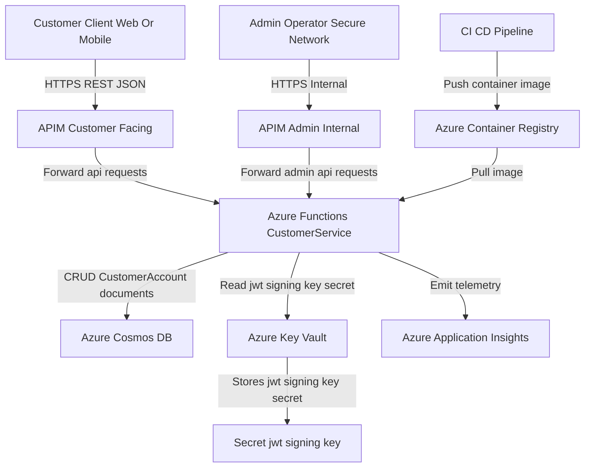
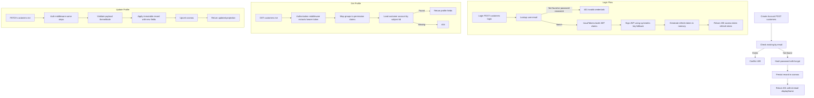
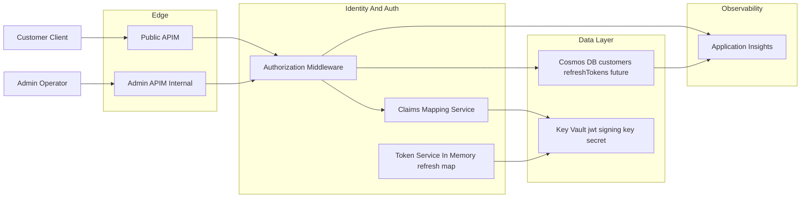

USER:
can you analyse all the code in this workspace (including all IaC and configuration files) and do the following:
- tell me what the purpose of this software is
- draw an architural diagram of the tech stack
- draw a diagram of program flow
- draw a diagram showing parts of the stack that address key information security concerns

As you produce output into this chat, keep a word-for-word record of my inputs and your outputs in a file called repository-analysis-with-iac-pass-4.md in the root of the workspace.

Ignore existing .md files - don't read their content as part of your analysis. Where possible, use mermaid diagrams for ease of viewing. Ensure the syntax and characters used in the mermaid diagrams are highly compatible with most parsers. For example, don't use parentheses, ( or ), anywhere in the mermaid diagram syntax.

ASSISTANT:
## Purpose
This repository implements a customer identity and profile microservice exposed via Azure Functions (isolated worker .NET 8) and fronted by two Azure API Management (APIM) gateways: one public customer facing and one internal admin facing. It manages customer accounts (create, authenticate, view, update), issues JWT access and refresh tokens (refresh path currently stubbed), maps external Azure AD group memberships to internal permission claims, and provides admin endpoints protected by policy based authorization. Data is stored in Azure Cosmos DB. Secrets and signing keys are intended to reside in Azure Key Vault (with a development symmetric key fallback). Telemetry flows to Application Insights. Deployment and infra are defined as code with Bicep, including APIM, Cosmos DB, Key Vault, Function App (container deployed from ACR), and networking for an internal admin APIM.

## High Level Architectural Diagram

## Program Flow (Key User Journeys)

## Security Focus Diagram

## Security Controls And Gaps
Controls:
- Segregated ingress: separate internal admin APIM instance intended for restricted network access
- Policy based authorization: attribute driven checks plus dynamic mapping from external groups to internal cs.permission claims and policies AdminRead and AdminWrite
- Principle of least privilege support: fine grained permission constants for read only vs read write admin operations
- Data partitioning: Cosmos DB partition key tenantId enabling multi tenant isolation patterns
- Unique key constraint on tenantId + normalizedEmail preventing duplicate accounts per tenant
- Secret management: Key Vault defined for jwt signing key secret storage with soft delete purge protection enabled and RBAC auth model
- HTTPS enforced: Function App httpsOnly true APIM uses TLS custom domain
- Telemetry: Application Insights integration for logging metrics aiding detection monitoring
- Dependency containerization: image pulled from private ACR (admin user disabled)

Notable gaps or risks:
- Refresh tokens not persisted securely In memory dictionary only no hashing no binding to user or revocation semantics implemented fully
- JWT signing via Key Vault not actually implemented fallback symmetric key always used and key rotation story incomplete
- Missing token validation pipeline no verification of signature audience issuer expiration implemented in middleware only parsing without validation
- MFA flow is placeholder not linked to account storage does not store or enforce secret
- Password policy absent no complexity rate limiting or lockout beyond fields in model unused
- No rate limiting throttling DDoS protection definitions in APIM policies not included
- No explicit logging of security relevant events like failed logins admin updates or token issuance
- Admin and public APIs currently share same backend function app without network isolation at function app level internal APIM does not enforce private endpoint to function
- Lack of encryption enforcement for Cosmos client side there is no at rest key rotation config referenced
- No data classification masking or PII minimization beyond simple model

## Recommendations (Prioritized)
1 Implement proper JWT validation middleware with signature audience issuer expiry and optionally Key Vault backed signing with cryptography client
2 Persist refresh tokens hashed with user binding tenant binding rotation chain and revocation audit using Cosmos refreshTokens container or alternate store
3 Complete MFA implementation tie secret to CustomerAccount.Security store encrypted secret implement verification during login issue step up tokens
4 Add APIM policies for rate limiting ip filtering request validation and response headers security
5 Separate admin function app or restrict function app access via private endpoints service endpoints and disable public network for Cosmos and Key Vault
6 Implement password complexity rules and lockout threshold leveraging existing FailedLoginAttempts and LockoutEndUtc
7 Centralize security audit logging include structured events for authentication authorization data changes
8 Add unit and integration tests for authorization middleware paths including policies and claim enrichment
9 Remove symmetric key from config in production rely solely on Key Vault and configure managed identity for function app with least privilege access to secret get
10 Implement secure secret retrieval JWT_SIGNING_KEY__KV_SECRET_NAME currently set but not read by code integrate retrieval at startup

## Textual Overview
The system is a foundational customer account microservice designed for extensibility into a fuller identity management solution. It already models core entities and authorization primitives while infrastructure as code provisions a production like baseline including dual APIM tier separation Key Vault and Cosmos DB. The critical next steps revolve around solidifying cryptographic key usage token lifecycle management MFA completion and network isolation.

ASSISTANT:
Duplicate of analysis provided in chat (maintaining transcript integrity).
## Purpose
This repository implements a customer identity and profile microservice exposed via Azure Functions (isolated worker .NET 8) and fronted by two Azure API Management (APIM) gateways: one public customer facing and one internal admin facing. It manages customer accounts (create, authenticate, view, update), issues JWT access and refresh tokens (refresh path currently stubbed), maps external Azure AD group memberships to internal permission claims, and provides admin endpoints protected by policy based authorization. Data is stored in Azure Cosmos DB. Secrets and signing keys are intended to reside in Azure Key Vault (with a development symmetric key fallback). Telemetry flows to Application Insights. Deployment and infra are defined as code with Bicep, including APIM, Cosmos DB, Key Vault, Function App (container deployed from ACR), and networking for an internal admin APIM.

## High Level Architectural Diagram

## Program Flow (Key User Journeys)

## Security Focus Diagram

## Security Controls And Gaps
Controls:
- Segregated ingress: separate internal admin APIM instance intended for restricted network access
- Policy based authorization: attribute driven checks plus dynamic mapping from external groups to internal cs.permission claims and policies AdminRead and AdminWrite
- Principle of least privilege support: fine grained permission constants for read only vs read write admin operations
- Data partitioning: Cosmos DB partition key tenantId enabling multi tenant isolation patterns
- Unique key constraint on tenantId + normalizedEmail preventing duplicate accounts per tenant
- Secret management: Key Vault defined for jwt signing key secret storage with soft delete purge protection enabled and RBAC auth model
- HTTPS enforced: Function App httpsOnly true APIM uses TLS custom domain
- Telemetry: Application Insights integration for logging metrics aiding detection monitoring
- Dependency containerization: image pulled from private ACR (admin user disabled)

Notable gaps or risks:
- Refresh tokens not persisted securely In memory dictionary only no hashing no binding to user or revocation semantics implemented fully
- JWT signing via Key Vault not actually implemented fallback symmetric key always used and key rotation story incomplete
- Missing token validation pipeline no verification of signature audience issuer expiration implemented in middleware only parsing without validation
- MFA flow is placeholder not linked to account storage does not store or enforce secret
- Password policy absent no complexity rate limiting or lockout beyond fields in model unused
- No rate limiting throttling DDoS protection definitions in APIM policies not included
- No explicit logging of security relevant events like failed logins admin updates or token issuance
- Admin and public APIs currently share same backend function app without network isolation at function app level internal APIM does not enforce private endpoint to function
- Lack of encryption enforcement for Cosmos client side there is no at rest key rotation config referenced
- No data classification masking or PII minimization beyond simple model

## Recommendations (Prioritized)
1 Implement proper JWT validation middleware with signature audience issuer expiry and optionally Key Vault backed signing with cryptography client
2 Persist refresh tokens hashed with user binding tenant binding rotation chain and revocation audit using Cosmos refreshTokens container or alternate store
3 Complete MFA implementation tie secret to CustomerAccount.Security store encrypted secret implement verification during login issue step up tokens
4 Add APIM policies for rate limiting ip filtering request validation and response headers security
5 Separate admin function app or restrict function app access via private endpoints service endpoints and disable public network for Cosmos and Key Vault
6 Implement password complexity rules and lockout threshold leveraging existing FailedLoginAttempts and LockoutEndUtc
7 Centralize security audit logging include structured events for authentication authorization data changes
8 Add unit and integration tests for authorization middleware paths including policies and claim enrichment
9 Remove symmetric key from config in production rely solely on Key Vault and configure managed identity for function app with least privilege access to secret get
10 Implement secure secret retrieval JWT_SIGNING_KEY__KV_SECRET_NAME currently set but not read by code integrate retrieval at startup

## Textual Overview
The system is a foundational customer account microservice designed for extensibility into a fuller identity management solution. It already models core entities and authorization primitives while infrastructure as code provisions a production like baseline including dual APIM tier separation Key Vault and Cosmos DB. The critical next steps revolve around solidifying cryptographic key usage token lifecycle management MFA completion and network isolation.
