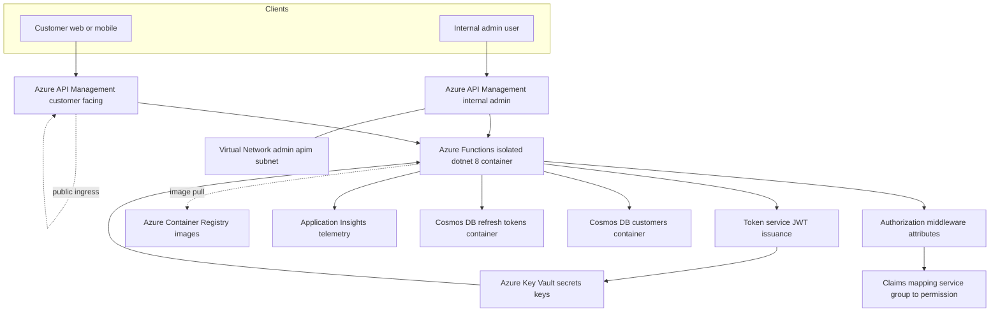
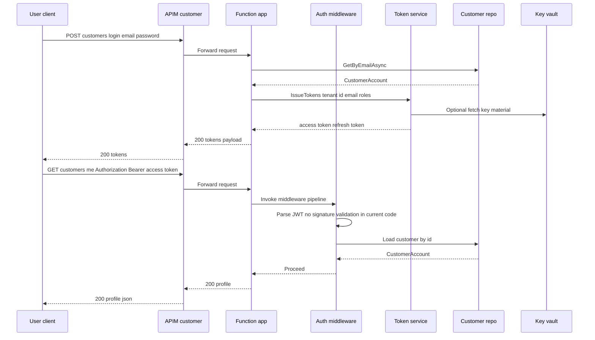
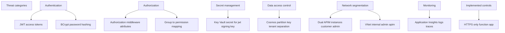

USER INPUT:
can you analyse all the code in this workspace (including all IaC and configuration files) and do the following:
- tell me what the purpose of this software is
- draw an architural diagram of the tech stack
- draw a diagram of program flow
- draw a diagram showing parts of the stack that address key information security concerns

As you produce output into this chat, keep a word-for-word record of my inputs and your outputs in a file called repository-analysis-with-iac-pass-5.md in the root of the workspace.

Ignore existing .md files - don't read their content as part of your analysis. Where possible, use mermaid diagrams for ease of viewing. Ensure the syntax and characters used in the mermaid diagrams are highly compatible with most parsers. For example, don't use parentheses, ( or ), anywhere in the mermaid diagram syntax.

ASSISTANT OUTPUT:
Purpose
The repository implements a customer identity and profile microservice using Azure Functions (isolated worker .NET 8) that provides customer self service endpoints account creation login token issuance profile retrieval update MFA enrollment verification plus internal admin endpoints for customer data management. Infrastructure as Code provisions supporting Azure resources API Management for public and internal exposure Cosmos DB for persistence Key Vault for secret key management Container Registry for deployment VNet segmentation for internal admin API and observability via Application Insights. It issues JWT access tokens and simple in memory refresh tokens and applies attribute driven authorization with enrichment of external identity provider group claims into internal permission claims.

High level capabilities
- Account lifecycle create login logout refresh stub MFA enroll verify
- Profile management get and partial update for authenticated user
- Admin read update operations protected by permission policies
- JWT issuance with optional Key Vault integration fallback symmetric key
- Claims enrichment mapping external group ids to internal permission claims
- Cosmos DB storage of customer accounts refresh tokens repository abstractions
- Infrastructure provisioning of APIM split customer vs admin internal instance Key Vault Cosmos ACR Function App VNet

Assumptions and inferred intent
- Designed to sit behind API Management to enforce external security policies rate limiting and potentially JWT validation before reaching function app
- Multi tenant ready via tenantId partition key though currently hard coded default usage
- Intended future enhancement to persist and bind refresh tokens to users rather than in memory dictionary
- MFA flow placeholder not yet integrated with account state secrets not persisted encrypted

Architectural diagram (tech stack)

Program flow diagram (example Login then GetMe)

Security mapping diagram

Key information security considerations
Strengths
- Passwords hashed with BCrypt reducing risk of offline brute force
- Claims based authorization with extensible permission policies supports least privilege
- Group to permission mapping decouples external IdP representation from internal permissions
- Partitioned Cosmos DB with unique key on tenant and normalized email enforces uniqueness per tenant and supports logical isolation
- Key Vault integration path present for asymmetric signing future HSM use
- API Management fronting functions enables central policies caching rate limiting threat protection
- Separate internal admin APIM potential for tighter network controls via VNet
- Application Insights integration for telemetry aiding detection response

Gaps and risks
- JWT tokens are only parsed not validated signature audience issuer not verified in middleware susceptible to token forgery must add validation using TokenValidationParameters and security keys
- Key Vault signing path not implemented NotImplementedException causes fallback to symmetric key risk if weak key or exposed environment variable
- Refresh tokens stored only in memory dictionary not user bound lost on restart cannot revoke selectively cannot scale out recommend persistent hashed storage implemented partially by CosmosRefreshTokenRepository but not wired into flow
- MFA enrollment and verification not tied to account record secret not persisted encrypted thus not enforcing step up authentication
- Admin and customer endpoints share same function app surface admin endpoints rely solely on route path risk of exposure recommend separate function app behind private endpoint or restrict via APIM policy and network
- No brute force protection or rate limiting at function level rely on APIM must configure throttling and lockout logic increase FailedLoginAttempts and lockout thresholds
- No password complexity or rotation policies enforced during account creation
- No encryption of TOTP secret at rest TotpSecretEncrypted field unused
- Cosmos DB public network access enabled consider private endpoints firewall restrictions
- Key Vault public network allowed consider private endpoints and RBAC

Recommended remediation actions
- Implement robust JWT validation verify signature issuer audience expiration nbf jti store jti for replay detection
- Complete Key Vault asymmetric signing path or at minimum fetch secret from Key Vault instead of plain config
- Integrate refresh token repository to persist hashed tokens tie to user id support rotation reuse detection and revocation
- Persist and encrypt MFA TOTP secret in account security section using Key Vault or data protection API and require valid auth to enroll verify store MfaEnabled
- Introduce password policy validation and breach password checking optional
- Add rate limiting at APIM brute force detection update FailedLoginAttempts lockout logic
- Separate admin functionality into distinct function app or enforce network isolation using private endpoints and internal load balancing
- Enable Cosmos DB role based access disable local auth already set and restrict public network
- Add automated tests around authorization middleware parsing and enforcement
- Add structured logging of security relevant events login failures token issuance refresh usage revocations

Notable design patterns
- Attribute oriented cross cutting authorization using middleware to inspect method custom attributes
- Repository abstraction for data persistence enabling easier swap or unit testing
- Record types for immutable domain models with copy updates using with
- Lazy evaluation of symmetric key fallback for token signing

Testing coverage highlights
- Unit tests validate token issuance basic JWT structure no cryptographic validation tests
- Claims mapping and permission evaluation tests present
- Model immutability and default values tested
- Missing tests for middleware flows account creation password hash verification refresh tokens MFA flows admin policies

Summary
The service is a foundational customer identity profile and authorization layer prepared for cloud native deployment on Azure with modular infrastructure. Security posture is partially implemented with clear scaffolding for robust controls but requires completion of token validation refresh token persistence MFA integration and network isolation to be production ready.

END OF ASSISTANT OUTPUT
